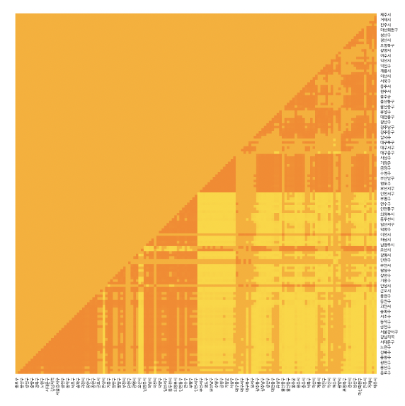
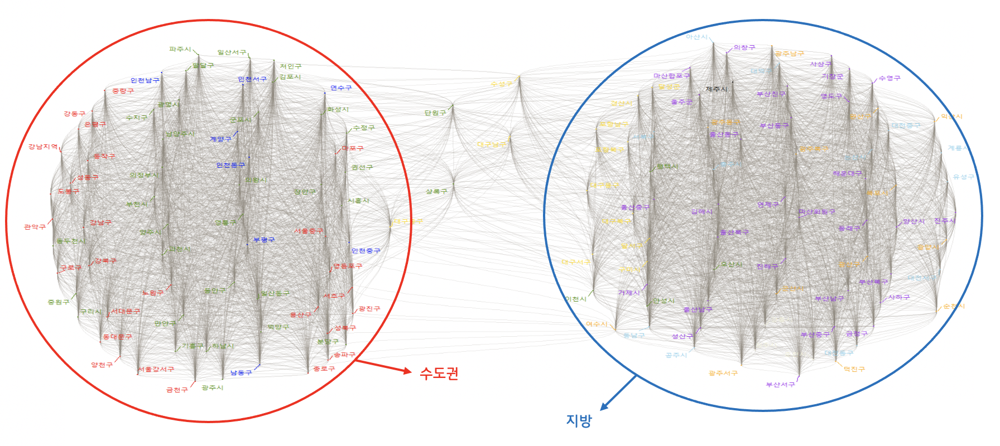
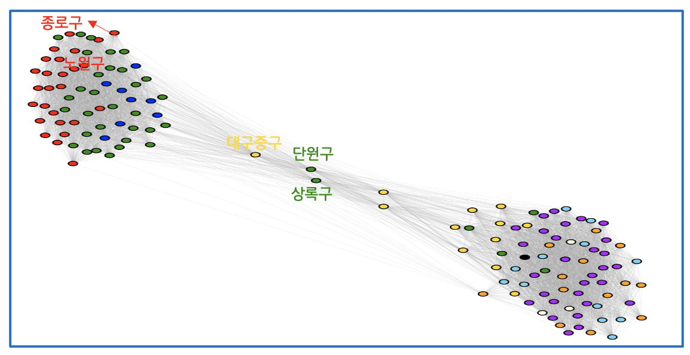
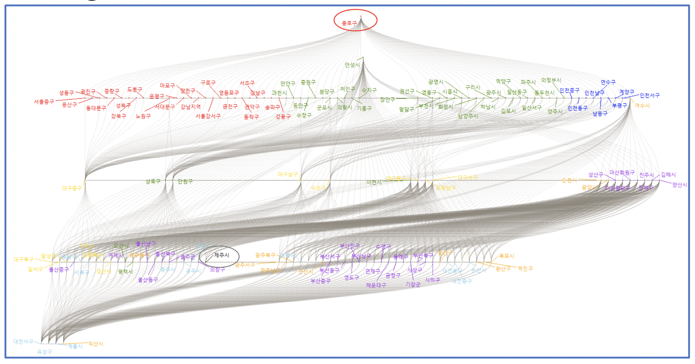
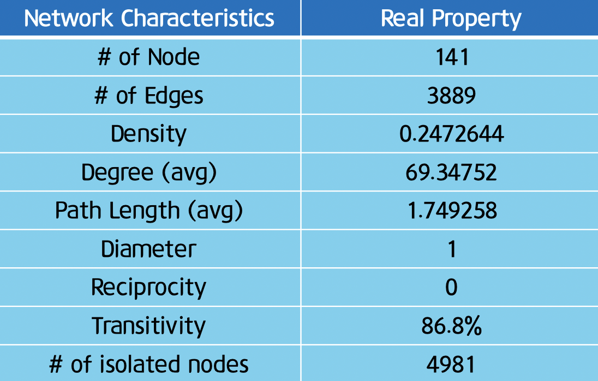

# Social Network Analysis

- Subject : Expressing Korea’s Real Estate Network with Social Network
- Language : R

## Data Introduction
- '한국감정원'의 지역별 아파트 가격 지수 (2009.01 ~ 2019.12)

위의 Data Table을 가공 > 지역별 조합과 아파트 가격 지수 상관성을 기반으로 Edge List 생성
  
## EDA
- Heat Map  
  
> 대체로 수도권은 수도권끼리 지방은 지방끼리 상관계수가 높은 것을 알 수 있다.  

## Data Visualization
### Network Graph 1  
  
> Network를 보면, 수도권과 지방이 나뉘어 분포하는 것을 볼 수 있다.

### Network Graph 2
  
*Degree Centrality : 대구광역시 중구가 가장 높다.*    
*Betweenness Centrality : 안산시 상록구가 가장 높다.*  
*Closeness Centrality : 안산시 단원구가 가장 높다.*  
*Closeness Centrality (out) : 서울특별시 종로구가 가장 높다.*  
*Eigenvector Centrality : 서울특별시 노원구가 가장 높다.*  

> Degree Centrality 란 - 각 노드가 다른 노드와 얼마나 연결되어 있는지 그 횟수를 세어 중요도를 측정하는 지표  
> Betweenness Centrality 란 - 노드 간의 흐름을 고려하여 중요도를 측정하는 지표 (최단 경로로 끼이게 되는 경우의 수)  
> Closeness Centrality 란 - 접근성 측면에서 노드의 중요도를 측정하는 지표  
> Eigenvector Centrality 란 - 노드별 가중치를 고려하여 중요도를 측정하는 지표  

### Network Graph 3
  
*다른 노드로부터 정보를 전달할 때, 가장 효율적인 노드 : 서울특별시 종로구*  
*다른 노드로부터 모든 정보를 수집할 때, 가장 효율적인 노드 : 제주특별자치도 제주시*  

## Conclusion
- Transitivity (추이성) - 86.8% 
> Transitivity 란 - 각 노드가 다른 노드와 얼마나 연결되어 있는지 그 횟수를 세어 중요도를 측정하는 지표  

- Degree Centrality가 가장 높은 지역은 대구광역시 중구이다. 수도권과 떨어져 있지만 대구광역시가 대표적인 부동산 투기 지역으로 인식된 적이 있어 높은 중심성을 보이는 것 같다. (대구지역은 지방보다는 수도권과 가격이 비슷한 모습이다.)  

- Closeness Centrality가 근접 중심성이 가장 높은 지역은 안산시 단원구이다. 안산시 지역이 대부분 네트워크 그래프에서 수도권과 멀리 떨어져있는 모습을 볼 수 있는데, 안산 지역이 다른 수도권 지역에 비해 아파트 가격이 낮은 편이라 수도권과 지방 중간에 위치하는 모습을 보이는 것 같다.  

- Betweenness Centrality가 가장 높은 지역은 안산시 상록구이다. 상록구가 부동산 시장의 가격변동 흐름에 통제 능력을 갖고 있고 부동산 가격 정보를 많이 가지고 있다고 판단 할 수 있다.  

- Eigenvector Centrality가 가장 높은 지역은 서울특별시 노원구이다. 노원구가 전국 아파트 가격흐름을 파악하는데 중요한 역할을 한다고 볼 수 있다.  

#### 아파트 부동산 시장의 흐름을 파악해보고 싶을 때, 종로구의 부동산 시장 흐름을 잘 파악해 보면 될것같다. 또한, 이 분석을 통해서 대구 지역의 부동산 가격을 파악할 수 있었고, 안산의 상록구와 단원구는 수도권 부동산 시장에서 떨어져 나와있는 것을 알 수 있었다. 마지막으로, 대부분 수도권은 수도권끼리 지방은 지방끼리 부동산 시장을 형성하는 것 같다.

#### < Conclusion Table >
  
